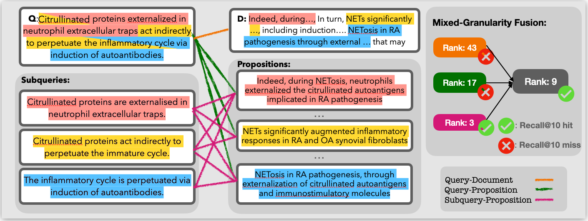

<h1 align="center">MixGR: Enhancing Retriever Generalization for Scientific Domain through Complementary Granularity</h1>

<h4 align="center">
    <p>
        <a href="https://arxiv.org/abs/2407.10691">📑 Paper</a> |
        <a href="#installation">🔧 Installation</a> |
        <a href="#resources">📚 Resources</a> |
        <a href="#usage">🚀 Usage</a> |
        <a href="#citing">📄 Citing</a>
    </p>
</h4>

> **Abstract:**
>
>  Recent studies show the growing significance of document retrieval in generating LLMs within the scientific domain by bridging their knowledge gap; however, dense retrievers struggle with domain-specific retrieval and complex query-document relationships. To address these challenges, MixGR improves dense retrievers' awareness of query-document matching across various levels of granularity using a zero-shot approach, fusing various metrics into a united score for comprehensive query-document similarity. Our experiments demonstrate MixGR outperforms previous retrieval methods by 22.6% and 10.4% on nDCG@5 for unsupervised and supervised retrievers, respectively, and enhances efficacy in two downstream scientific question-answering tasks, boosting LLM applications in the scientific domain.

<div style="text-align: center">
    
</div>

<h2 id="installation">Installation</h2>

Install the environment based on `requirements.txt`:

```bash
pip install -r requirements.txt
```

<h2 id="resources">Resources</h2>

### Data
In our paper, we conduct experiment on four scineitific datasets, i.e., [NFCorpus](https://www.cl.uni-heidelberg.de/statnlpgroup/nfcorpus/), [SciDocs](https://huggingface.co/datasets/BeIR/scidocs), [SciFact](https://huggingface.co/datasets/BeIR/scifact), and [SciQ](https://huggingface.co/datasets/bigbio/sciq).
In the folder `data/`, we include:
- queries including multiple subqueries and their decomposed subqueries;
- the documents and their decomposed propositions;
- qrels, recording the golden query-document maps.

For the procedure of subquery and proposition generation, please refer to the instruction of **Query and Document Decomposition** in the following section.

### Propositioner
Regarding query and document decomposition, we apply the off-the-shelf tool, [*propositioner*](https://huggingface.co/chentong00/propositionizer-wiki-flan-t5-large) which is hosted on huggingface.
For the environment for the usage of propositioner, please refer to [the original repository](https://github.com/chentong0/factoid-wiki).

<h2 id="usage">Usage</h2>

Before all, we would suggest setting the current directory as the environment variable `$ROOT_DIR`. Additionally, corpus indexing and query searching depend on [pyserini](https://github.com/castorini/pyserini).

### Query and Document Decomposition

For query and docuemnt decomposition, please refer to `script/decomposition/query.sh` and `script/decomposition/document.sh`, respectively.
The tool itself is not 100 percent perfect. For the potential error, please refer to the error analysis in Appendix of the paper.

### Index Generation

Both [documents](scripts/index/index_chunk_dense.sh) and [propositions](scripts/index/index_prop_dense.sh) are indexed through the default framework `pyserini`.
Additionally, we need to generate the BM25 index for both [documents](scripts/index/index_chunk_bm25.sh) and [propositions](scripts/index/index_prop_bm25.sh). This can help avoid the maintenace of the corpus in the memory, instead fetch the text from the disk.

### Document/Proposition Searching

Given queries/subqueries and documents/propositions, we would calculate the quandrant combination between different granularities of queries and documents.

|       | Document | Proposition |
|-------|----------|-------------|
| Query | $s_{q\text{-}d}$: [Query-Document](scripts/search/query_chunk.sh) | $s_{q\text{-}p}$: [Query-Proposition](scripts/search/query_prop.sh) |
| Subquery | $s_{s\text{-}d}$: [Subquery-Document](scripts/search/subquery_chunk.sh) | $s_{s\text{-}p}$: [Subquery-Proposition](scripts/search/subquery_prop.sh) |

### Generation of the union set

As mentioned in the paper, we retrieve the top-$k$ results $R^k_{q\text{-}d}$, $R^k_{q\text{-}p}$, and $R^k_{s\text{-}p}$ by $s_{q\text{-}d}$, $s_{q\text{-}p}$, and $s_{s\text{-}p}$, respectively, where $k$ is set 200 empirically.
When a query-doc pair ($\mathrm{q}'$, $\mathrm{d}'$) in one retrieval result does not exist in the other sets (e.g., $(\mathrm{q}', \mathrm{d}') \in R^k_{q\text{-}d}$ but $(\mathrm{q}', \mathrm{d}') \notin R^k_{q\text{-}p}$), we will calculate the missing similarity (e.g., $s_{q\text{-}p}(\mathrm{q}',\mathrm{d}')$) before aggregation. This process is included in `scripts/rrf/union.sh`.

### Reciprocal rank fusion

Lastly, we merge the retrieval results from different query and document granularities through [RRF](scripts/rrf/fusion.sh).

$$
\begin{align*}
    s_f(\mathrm{q}, \mathrm{d}) = \frac{1}{1 + r_{q\text{-}d}(\mathrm{q}, \mathrm{d})} + \frac{1}{1 + r_{q\text{-}p}(\mathrm{q}, \mathrm{d})} + \frac{1}{1 + r_{s\text{-}p}(\mathrm{q}, \mathrm{d})},
    \label{eq:rrf}
\end{align*}
$$

### Evaluation

The resuls presented in the paper is convered by `result_collection.ipynb`, where the evaluation is based on the package `beir`.

<h2>Contact</h2>

This repository contains experimental software intended to provide supplementary details for the corresponding publication. If you encounter any issues, please contact [Fengyu Cai](mailto:fengyu.cai@tu-darmstadt).

<h2>Licence</h2>

The software in this repocitory is licensed under the Apache License, Version 2.0. See [LICENSE](LICENCE) for the full license text.

<h2 id="citing">Citing</h2>
